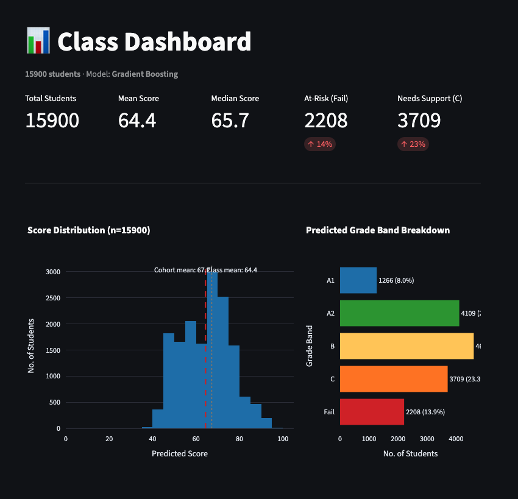

# 🎓 Student Score Predictor

A deployed machine learning web app that predicts secondary school exam scores
from student behavioral and demographic data — helping educators identify
at-risk students and simulate targeted interventions.

🔗 **[Live Demo →](https://your-app.streamlit.app)**



---

## Features

- **📂 Predict** — Upload a class CSV or enter a single student manually;
  get predicted scores and risk bands (Fail / C / B / A) instantly
- **📊 Dashboard** — Class-wide score distribution, at-risk student table,
  and feature snapshot charts across the cohort
- **🔍 What-If Simulator** — Adjust study hours, attendance, sleep, tuition,
  and CCA for any student and see the predicted score change in real time

---

## ML Models & Results

Four models were trained and evaluated using 5-fold cross-validation on
a dataset of secondary school students.

| Model | CV RMSE | Test RMSE | Test MAE | Test R² |
|---|---|---|---|---|
| Dummy (mean baseline) | 13.98 | 13.99 | 11.66 | 0.000 |
| Ridge (α=10) | 9.13 | 8.98 | 7.13 | 0.588 |
| Random Forest (tuned) | 5.36 | 5.35 | 3.70 | 0.854 |
| **Gradient Boosting (tuned)** | **5.35** | **5.28** | **3.69** | **0.858** |

**Gradient Boosting** was selected as the default model. It achieves a
test MAE of **3.69 points** (on a 0–100 scale) with an R² of **0.858**,
and shows no overfitting (CV RMSE ≈ Test RMSE). All models are selectable
from the app sidebar.

Key predictive features: `attendance_rate`, `hours_per_week`,
`sleep_duration`, `tuition`, `CCA`.

---

## Tech Stack

| Layer | Tools |
|---|---|
| App framework | Streamlit |
| ML & preprocessing | scikit-learn, pandas, NumPy |
| Visualisation | Plotly |
| Model persistence | joblib |
| Deployment | Streamlit Community Cloud |

---

## Project Structure

```
├── app/
│ ├── pages/
│ │ ├── 1_predict.py
│ │ ├── 2_dashboard.py
│ │ └── 3_what_if.py
│ └── utils/
│ ├── charts.py
│ ├── loader.py
│ └── data_loader.py
├── models/ # Serialised .pkl pipelines
├── data/
│ └── score.csv
├── requirements.txt
└── README.md
```

---

## Run Locally

```bash
git clone https://github.com/your-username/student-score-predictor
cd student-score-predictor
pip install -r requirements.txt
streamlit run app/1_predict.py
```

## Dataset

Adapted from the AIAP Technical Assessment dataset. Features include
study hours, attendance rate, sleep duration, CCA, tuition enrolment,
learning style, transport mode, and demographic variables.